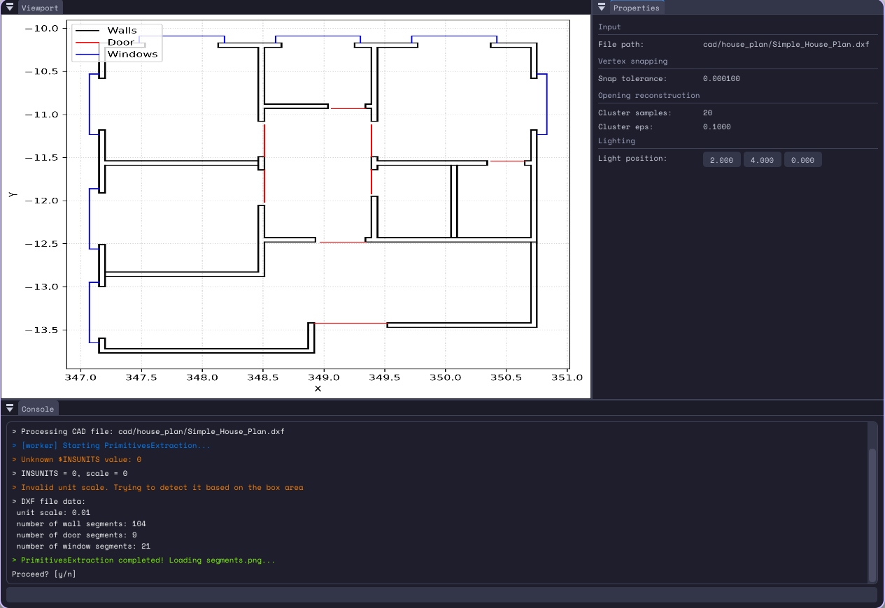
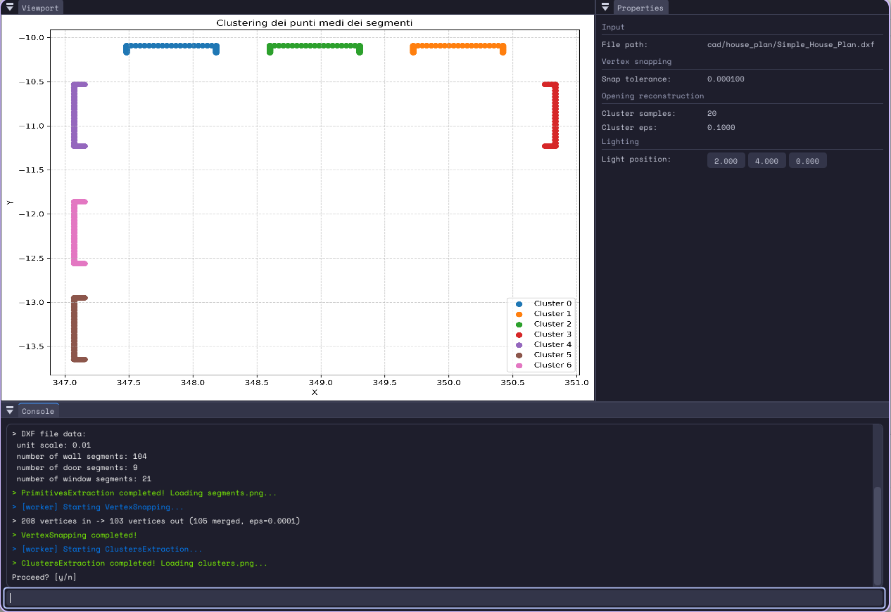
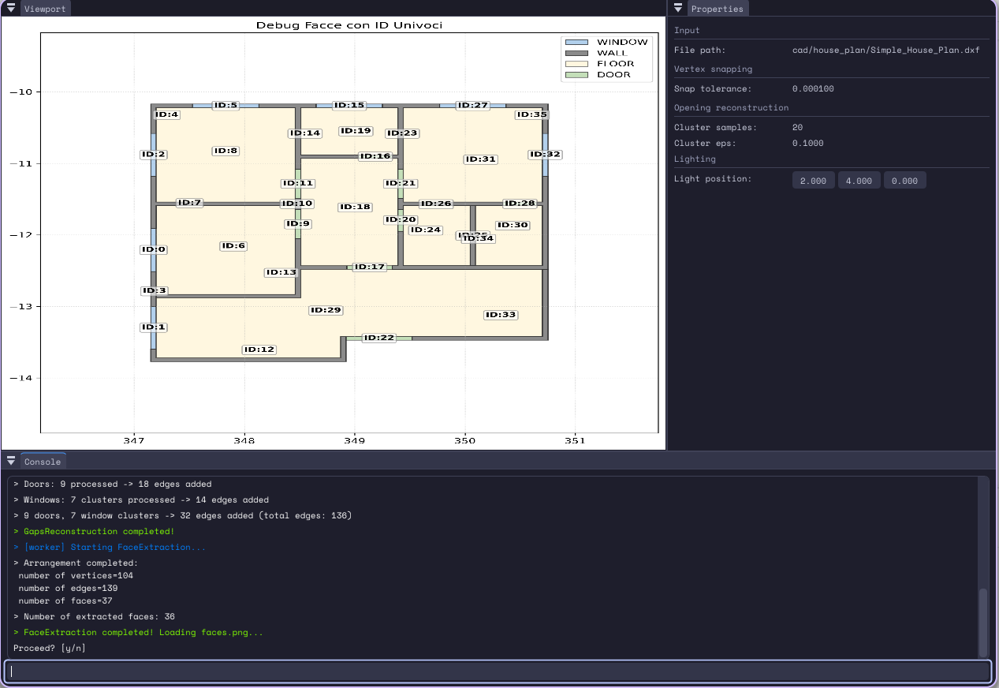
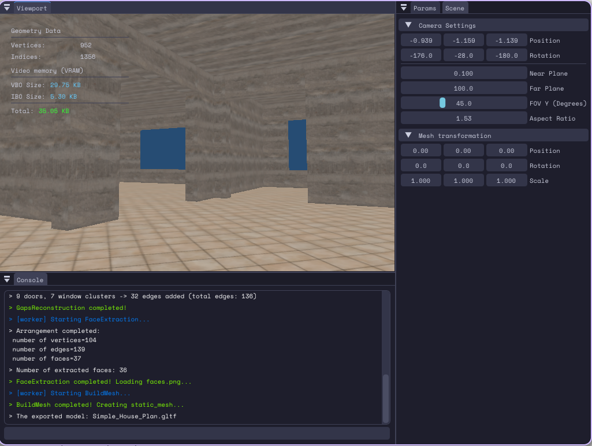

## Screenshots









## Building and running the code

Install Conan package manager with pip:

```bash
pip install conan
```

This will detect the operating system, build architecture and compiler settings based on the environment.
It will also set the build configuration as Release by default

```bash
conan profile detect --force
```

We will use Conan to install dependencies and generate the files that CMake needs to find these libraries and build our project.
We will generate those files in the folder **build**.

```bash
conan install . \
  --output-folder=build \
  --build=missing \
  -s build_type=Debug \
  -c tools.system.package_manager:mode=disabled
```

Conan generated several files under the **build** folder.

To build the project:

```bash
cmake -S . -B ./build -DCMAKE_TOOLCHAIN_FILE=build/build/Debug/generators/conan_toolchain.cmake
```

To compile:

```bash
cmake --build ./build/ --parallel 8
```

Run:

```bash
./build/Plan2Scene <input.dxf>
```