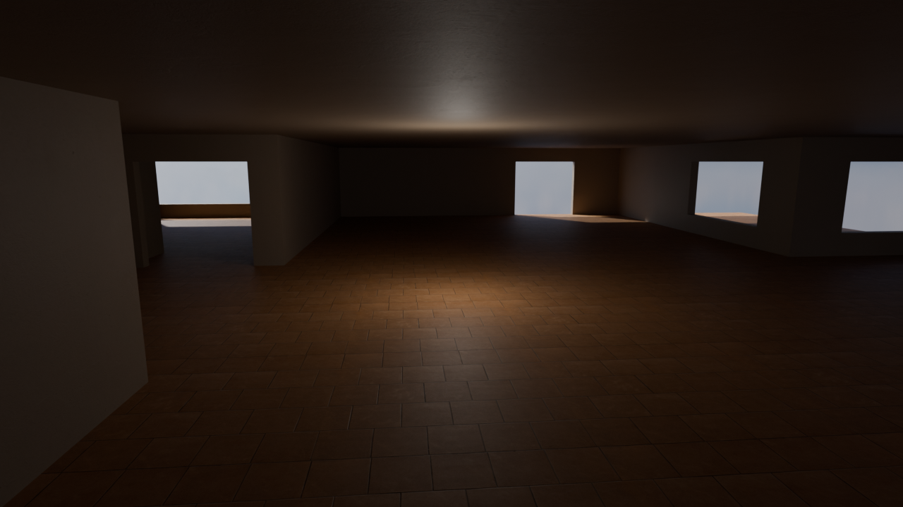
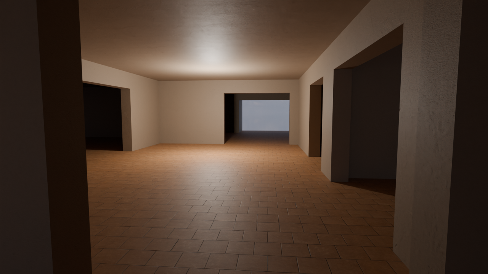

## Screenshots






## Configuration (C++ Program)

The C++ program reads all its parameters from a **JSON configuration file**.  
Each CAD model requires its own configuration file, as parameters may vary depending on the drawing scale, geometry complexity, and desired output quality.

Example of `config.json`:

```json
{
  "dxf_file": "file.dxf",
  "unit_scale": 0.1,
  "snap_eps": 1e-4,
  "cluster_num_samples": 10,
  "cluster_eps": 1.0,
  "ceil_height": 10.0,
  "floor_texture_scaling": 2.0,
  "wall_texture_scaling": 2.0
}
```

- **dxf_file** – Path to the input DXF file.
- **unit_scale** – Scaling factor applied to the mesh. Typical values: 1.0, 0.1, or 0.01. Choose the value that matches the drawing units of your CAD model.
- **snap_eps** – Tolerance for vertex snapping. Neighbouring vertices closer than this threshold are merged. May need adjustment if unit_scale changes.
- **cluster_num_samples** – Number of sample points taken along each segment during clustering. Used for door/window detection.
- **cluster_eps** – Maximum distance between sample points to be considered part of the same cluster (window/door). If clusters are not correctly separated (i.e. each window appears with a distinct colour in the visualisation), tweak this value together with cluster_num_samples.
- **ceil_height** – Height of the walls (ceiling level) in world units.
- **floor_texture_scaling** – Texture scaling factor for floor and ceiling surfaces. Smaller values make the texture appear more repeated (tighter tiling); - larger values enlarge the texture pattern but reduce visible detail. Find a balance that avoids obvious repetition while maintaining quality.
- **wall_texture_scaling** – Same as above but applied to wall surfaces.


## Building (C++ program)

Install Conan package manager with pip:

```bash
pip install conan
```

Detect your system profile:

```bash
conan profile detect --force
```

Install dependencies and generate build files:

```bash
conan install . \
  --output-folder=build \
  --build=missing \
  -s build_type=Debug \
  -c tools.system.package_manager:mode=disabled
```

Configure CMake using the Conan toolchain:

```bash
cmake -S . -B ./build -DCMAKE_TOOLCHAIN_FILE=build/build/Debug/generators/conan_toolchain.cmake
```

Compile the project:

```bash
cmake --build ./build/ --parallel 8
```

## Run (C++ program)

Before executing the program, create and activate a Python virtual environment (used for visualisation scripts):

```bash
python -m venv venv
source venv/bin/activate
pip install pandas matplotlib
```

The program runs in GUI mode using OpenGL and Dear ImGui.
At each pipeline step, a textured preview of the partial result is shown.
The user must confirm the step by typing y (yes) or n (no) in the terminal.

Launch the program by passing the JSON configuration file as an argument:

```bash
./build/Plan2Scene cad/house_plan/Simple_House_Plan.json
```

## Blender rendering

Once the 3D model has been exported as a GLTF file (without embedded materials), the photorealistic rendering is performed using Blender and its Python API (bpy).

The rendering is driven by a separate JSON configuration file (blender_config.json), which centralises all rendering parameters:
- **Rendering settings** – samples per pixel, resolution, output image path.
- **Scene assets** – GLTF model path, HDRI environment map, and HDRI intensity.
- **Camera** – position, orientation (degrees), field of view.
- **Lighting** – point light and sun light parameters (energy, colour, angle, position).
- **Materials** – texture paths (albedo, normal, roughness, metallic, AO, displacement, ARM) and numeric parameters (strength, scale, fallback values).

To launch the rendering in headless mode, use:

```bash
blender -b -P render_scene.py
```

The script reads blender_config.json, sets up the scene, applies all materials, and saves the final image to the specified output path.
