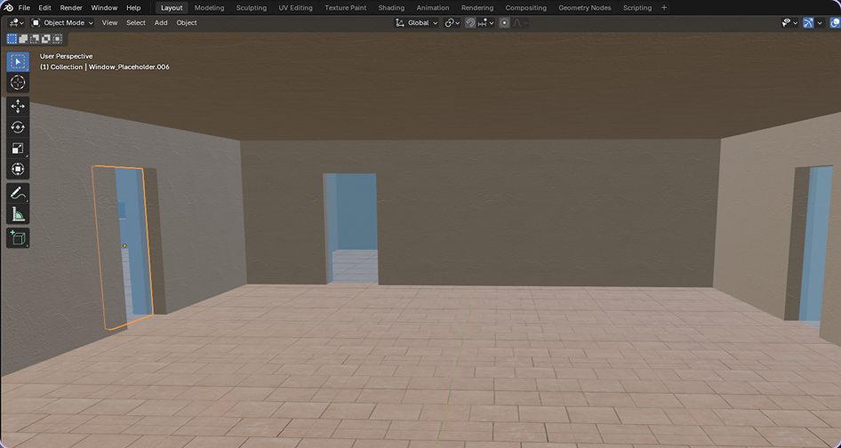
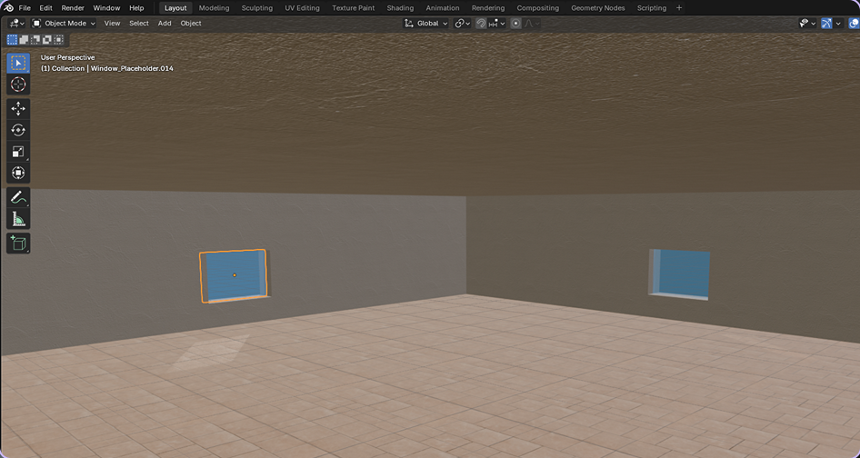
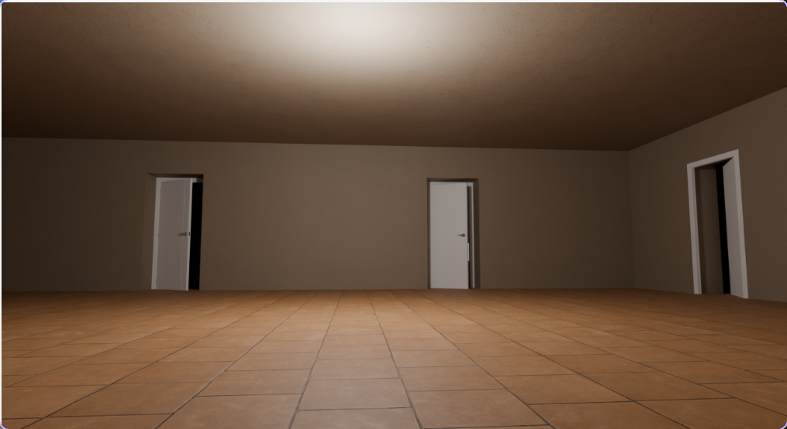
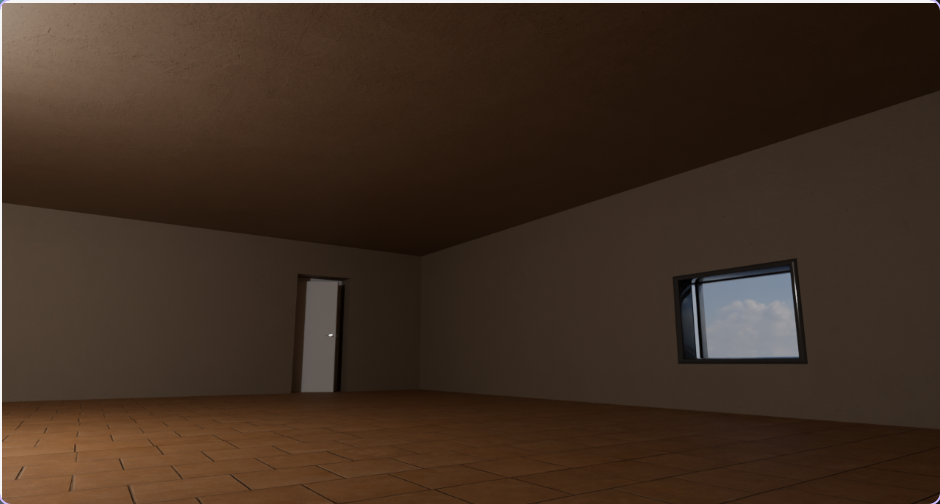
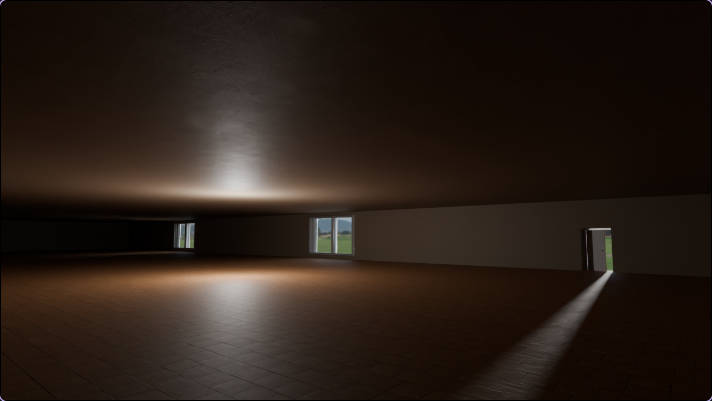

## Screenshots












## Building

Install Conan package manager with pip:

```bash
pip install conan
```

Detect your system profile:

```bash
conan profile detect --force
```

Install dependencies and generate build files:

```bash
conan install . \
  --output-folder=build \
  --build=missing \
  -s build_type=Debug \
  -c tools.system.package_manager:mode=disabled
```

Configure CMake using the Conan toolchain:

```bash
cmake -S . -B ./build -DCMAKE_TOOLCHAIN_FILE=build/build/Debug/generators/conan_toolchain.cmake
```

Compile the project:

```bash
cmake --build ./build/ --parallel 8
```

## Run

Before executing the program, create and activate a Python virtual environment (used for visualisation scripts):

```bash
python -m venv venv
source venv/bin/activate
pip install -r requirements.txt
```
Launch the program by passing the JSON configuration file as an argument:

```bash
./build/Plan2Scene cad/house_plan/Simple_House_Plan.json
```